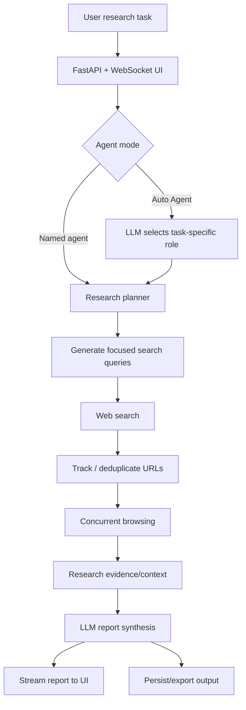

# AI Research Agent

**Planner–execution web research system for studying reliable, source-grounded LLM agents**

[](https://github.com/anupamking01/Ai-Researcher-Agent/actions/workflows/tests.yml)
[](LICENSE)

This repository implements an agentic research workflow that decomposes a user question into focused search queries, retrieves and browses web sources, accumulates research context, and synthesizes a long-form report through an LLM. The current research direction is to make the pipeline **measurable and more reliable**, rather than treating agent orchestration as a black-box demo.

> **Research status:** active experimental project. The repository does **not** claim benchmark improvements or factuality gains that have not yet been measured.

## Why this project matters

Web-research agents combine several hard problems: planning, retrieval, source selection, asynchronous tool execution, evidence synthesis, failure recovery, and cost control. A system can produce fluent reports while still failing because it searched poorly, browsed inaccessible pages, used weak evidence, or generated unsupported claims.

This project therefore separates two goals:

1. **Build an end-to-end autonomous research workflow.**
2. **Evaluate where the workflow succeeds or fails using reproducible metrics and ablations.**

## Current capabilities

- task-specific **Auto Agent** role selection;
- LLM-driven decomposition of a research task into focused search queries;
- DuckDuckGo-based web search;
- order-preserving source tracking and URL deduplication during a run;
- asynchronous browsing/scraping across retrieved sources;
- accumulation of research context across queries;
- streamed report generation over WebSockets;
- FastAPI web application with a browser UI;
- PDF-oriented report export pipeline;
- offline evaluation utilities for completion, source success, latency, token/cost, and citation-support proxies;
- lightweight unit tests and GitHub Actions CI for the offline evaluation layer.

## System architecture



The core implementation lives in [`logic/research_agent.py`](logic/research_agent.py), with execution orchestration in [`logic/run.py`](logic/run.py) and model access / Auto Agent selection in [`logic/llm_utils.py`](logic/llm_utils.py).

For a detailed code-level walkthrough, see **[docs/ARCHITECTURE.md](docs/ARCHITECTURE.md)**.

## Implemented vs. research roadmap

| Capability | Status |
|---|---|
| Planner-style query decomposition | Implemented |
| Concurrent web research | Implemented |
| Source URL tracking | Implemented |
| Task-specific agent role selection | Implemented |
| Streamed report generation | Implemented |
| Offline run-metric aggregation | Implemented |
| Unit tests for evaluation utilities | Implemented |
| Claim-to-source verification | Planned |
| Verifier-guided report repair | Planned |
| Confidence-aware source filtering | Planned |
| Adaptive stopping / source budget | Planned |
| Systematic benchmark study | Planned |

This distinction is deliberate: planned features are not presented as completed work.

## Research questions

The current experimental plan focuses on four questions:

- **RQ1 — Research quality:** Does agentic task decomposition improve completeness and source coverage over a single-pass baseline?
- **RQ2 — Reliability:** Which stage contributes most to failures: planning, search, browsing, retrieval relevance, or synthesis?
- **RQ3 — Efficiency:** What quality–latency–cost trade-off is produced by different model and orchestration configurations?
- **RQ4 — Verification:** Can explicit evidence verification reduce unsupported claims enough to justify the additional inference cost?

The full protocol is documented in **[docs/EVALUATION.md](docs/EVALUATION.md)**.

## Evaluation design

The planned study compares progressively stronger systems under the same fixed task set:

| Variant | Planning | Multi-query retrieval | Concurrent browsing | Verification |
|---|---:|---:|---:|---:|
| Single-pass LLM baseline | No | No | No | No |
| Retrieval baseline | No | Yes | Yes | No |
| Current research agent | Yes | Yes | Yes | No |
| Research agent + verifier | Yes | Yes | Yes | Planned |

Metrics include:

- run completion rate;
- unique source coverage;
- source/browse success rate;
- manually evaluated claim support;
- report-quality rubric scores;
- wall-clock latency;
- prompt/completion tokens;
- estimated inference cost;
- failure categories and qualitative trace analysis.

The lightweight metric implementation is in [`logic/evaluation.py`](logic/evaluation.py). It is dependency-free so that experiment traces can be analyzed without network or model access.

## Repository structure

```text
Ai-Researcher-Agent/
├── app.py                    # FastAPI + WebSocket application
├── logic/
│   ├── research_agent.py     # planning, retrieval and report workflow
│   ├── llm_utils.py          # LLM access + Auto Agent selection
│   ├── prompts.py            # agent/report prompt definitions
│   ├── run.py                # run orchestration
│   └── evaluation.py         # offline experimental metrics
├── scrape/                   # search and web-browsing utilities
├── text_preprocess/          # text / report processing
├── frontend/                 # browser UI
├── settings/                 # configuration
├── docs/
│   ├── ARCHITECTURE.md
│   └── EVALUATION.md
├── tests/
│   └── test_evaluation.py
├── requirements.txt
├── requirements-dev.txt
└── CITATION.cff
```

## Quick start

### 1. Clone

```bash
git clone https://github.com/anupamking01/Ai-Researcher-Agent.git
cd Ai-Researcher-Agent
```

### 2. Install application dependencies

```bash
pip install -r requirements.txt
```

### 3. Configure the model API key

```bash
export OPENAI_API_KEY="YOUR_KEY"
```

You can also use a local `.env` file if preferred. Never commit API keys.

### 4. Run the application

```bash
uvicorn app:app --reload
```

Open `http://localhost:8000`.

### 5. Run offline tests

```bash
pip install -r requirements-dev.txt
pytest -q
```

The unit tests do not call an LLM or the web.

## Demo videos

- [Live Demo 1](https://www.loom.com/share/8c2be0f1afec491d8c1399da0fb50f47?sid=2cb8877f-ddfc-479c-ae52-9a84c145cdba)
- [Live Demo 2](https://www.loom.com/share/81ebdeb4f0004f4c94164d61266a4b09?sid=a7e69af2-c251-4e5e-bc02-3393d5e252bf)

## Limitations

The current system should be treated as an experimental research tool, not an authority.

- Web retrieval quality depends on the search provider and source availability.
- The default search utility currently retrieves a small fixed number of results per query.
- A larger number of sources does **not** automatically imply factual correctness or reduced bias.
- LLM synthesis can introduce unsupported statements even when useful evidence was retrieved.
- The current pipeline does not yet perform formal claim-to-citation verification.
- Provider/model behavior, cost, and latency can change over time.
- Generated research should be independently verified for high-stakes or academic use.

## Related work and architectural lineage

This project sits in the broader line of retrieval- and tool-augmented language-model research. The planner/execution research pattern and parts of the early project framing were influenced by the open-source **GPT Researcher** architecture; that lineage is explicitly acknowledged here.

Recommended references:

1. Yao et al., **“ReAct: Synergizing Reasoning and Acting in Language Models.”** arXiv:2210.03629, 2022. https://arxiv.org/abs/2210.03629
2. Lewis et al., **“Retrieval-Augmented Generation for Knowledge-Intensive NLP Tasks.”** NeurIPS 2020. https://arxiv.org/abs/2005.11401
3. Wang et al., **“Plan-and-Solve Prompting: Improving Zero-Shot Chain-of-Thought Reasoning by Large Language Models.”** arXiv:2305.04091, 2023. https://arxiv.org/abs/2305.04091
4. Shao et al., **“Assisting in Writing Wikipedia-like Articles From Scratch with Large Language Models (STORM).”** 2024. https://arxiv.org/abs/2402.14207
5. Elovic et al., **GPT Researcher**, open-source autonomous research-agent project. https://github.com/assafelovic/gpt-researcher

These references provide context; inclusion does not imply that every method in those systems is implemented here.

## Reproducibility and research integrity

For future experimental results, each reported number should be tied to:

- a fixed task-set version;
- a Git commit SHA;
- exact model/provider identifiers;
- prompt and model parameters;
- retrieval configuration;
- raw run traces;
- the evaluation script used to compute the metric.

No `TBD` result should be converted into a numerical claim until it has been measured reproducibly.

## Citation

Citation metadata is available in [`CITATION.cff`](CITATION.cff).

## Author

**Anupam Poddar**  
Generative AI / Machine Learning Engineer  
Research interests: autonomous agents, LLM reasoning and planning, trustworthy AI, agent evaluation, multimodal AI, and efficient AI systems.

- GitHub: https://github.com/anupamking01
- LinkedIn: https://www.linkedin.com/in/anupam-king01

## License

MIT — see [`LICENSE`](LICENSE).
