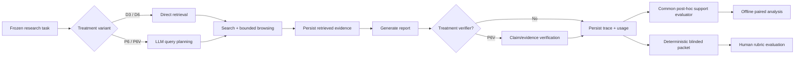

# AI Research Agent

**A reproducible web-research agent for studying how planning, retrieval depth, and verification should share a limited research budget.**

[](https://github.com/anupamking01/Ai-Researcher-Agent/actions/workflows/tests.yml)
[](LICENSE)

> ## Research question
> **Where should an autonomous research agent spend its inference and retrieval budget: deeper retrieval, explicit planning, or verification?**

This project is an end-to-end planner/execution web-research system **and** an experimental platform for measuring evidence support, resource use, failure modes, and quality–cost trade-offs. The research branch is intentionally designed so that treatment generation, post-hoc measurement, statistical analysis, and blinded human validation are separate stages.

> **Research integrity:** the repository does not claim benchmark superiority, factuality gains, or human-quality improvements that have not been reproducibly measured. Pilot evidence, main-study infrastructure, automated evaluation, and pending human evaluation are labeled separately.

## Research status

| Component | Status |
|---|---|
| End-to-end web research agent | ✅ Implemented |
| Versioned experiment traces and provenance | ✅ Implemented |
| Token / latency / model-call / cost accounting | ✅ Implemented |
| D3 / D6 / P6 / P6V treatment variants | ✅ Implemented |
| Diagnostic pilot | ✅ Completed and documented |
| Common post-hoc claim-support evaluator | ✅ Implemented |
| Frozen 10-task paired main-study design | ✅ Implemented |
| Evaluator-only recovery without replacing treatments | ✅ Implemented |
| Predeclared paired statistical analysis | ✅ Implemented and frozen |
| Deterministic blinded human-evaluation packets | ✅ Implemented |
| Human rubric annotations | ⏳ Pending real annotators |
| Final paper-level claims | ⏳ Pending canonical analysis + human validation |

A GitHub Actions workflow or recovery job can fail for operational reasons even when some treatment artifacts were produced. Final results must therefore be tied to the exact canonical artifact set and provenance used for analysis rather than inferred from a workflow label alone.

## Experimental design

The frozen main analysis isolates three stage-wise effects on the same task set:

| Variant | Planning | Scheduled browse budget | Treatment verification | Comparison |
|---|---|---:|---|---|
| **D3** | Direct | 3 | No | Retrieval baseline |
| **D6** | Direct | 6 | No | `D6 - D3`: retrieval depth |
| **P6** | Planner | 6 | No | `P6 - D6`: planning |
| **P6V** | Planner | 6 | Yes | `P6V - P6`: verification |

The study does **not** assume these variants consume equal total compute. Tokens, model calls, latency, web activity, and estimated cost are recorded so quality can be interpreted together with resource use.

## Research pipeline



This separation matters. `P6V` may use verification as part of the treatment, but every compared report can still receive the **same common post-hoc evaluator**, avoiding a measurement advantage that exists only for one treatment.

## What is measured

The primary automated outcome is **strict evidence support rate**:

```text
supported claims / claims checked
```

Secondary measurements include broad support, unsupported/contradicted claims, successful sources, total tokens, model calls, latency, report length, and estimated treatment cost.

The frozen main-study analysis uses paired task-level contrasts and reports mean/median differences, deterministic bootstrap confidence intervals, exact sign-flip/randomization p-values where the complete paired matrix exists, standardized paired effects when defined, and Holm adjustment across the three primary contrasts.

Because the task set is small, the project emphasizes **effect sizes, uncertainty, paired consistency, and transparent limitations** rather than binary significance claims.

## Human evaluation

Automated evidence-support scoring cannot fully answer whether a report is useful, complete, well sourced, well reasoned, and readable. The repository therefore includes a blinded human-evaluation workflow with five 1–5 rubric dimensions:

- correctness;
- completeness;
- source quality;
- synthesis / reasoning;
- clarity.

Build a deterministic offline packet from completed traces:

```bash
python scripts/build_human_eval_packet.py
```

The builder creates annotator-facing blinded reports and a ratings template while keeping the treatment mapping in a separate coordinator-only key. It fails closed on duplicate treatment/task cells, missing reports, incomplete runs, unexpected variants, or an incomplete task matrix.

**No human ratings are fabricated or generated by the system.** Real annotations remain pending.

See **[paper/HUMAN_EVAL_PROTOCOL.md](paper/HUMAN_EVAL_PROTOCOL.md)** for the frozen annotation procedure.

## Reproducibility map

A reviewer should be able to trace the project from question → treatment → evidence → measurement → inference:

| Artifact | Role |
|---|---|
| **[paper/RESEARCH_PROTOCOL.md](paper/RESEARCH_PROTOCOL.md)** | Research question, hypotheses, budget principles, threats to validity |
| **[paper/PILOT_RESULTS.md](paper/PILOT_RESULTS.md)** | Canonical diagnostic pilot and caveats |
| **[paper/ANALYSIS_PLAN.md](paper/ANALYSIS_PLAN.md)** | Frozen confirmatory main-study inference |
| **[paper/HUMAN_EVAL_PROTOCOL.md](paper/HUMAN_EVAL_PROTOCOL.md)** | Blinded human-quality evaluation |
| **[docs/EVALUATION.md](docs/EVALUATION.md)** | End-to-end evaluation methodology |
| `logic/experiment.py` | Experiment configuration / provenance data structures |
| `scripts/run_budget_main_study.py` | Main-study orchestration |
| `scripts/summarize_budget_main_study.py` | Offline validation and aggregation |
| `scripts/analyze_main_study.py` | Paired statistical analysis |
| `scripts/build_human_eval_packet.py` | Blinded human-evaluation packet builder |
| `tests/` | Offline experiment and analysis invariants |
| `.github/workflows/` | CI and explicitly controlled research workflows |

## Core agent capabilities

Outside the experimental layer, the application supports:

- task-specific **Auto Agent** role selection;
- LLM-driven research-question decomposition;
- DuckDuckGo-based web search;
- URL tracking and deduplication;
- asynchronous source browsing;
- accumulated evidence/context across research steps;
- streamed report generation over WebSockets;
- FastAPI browser UI;
- Markdown/PDF report persistence;
- retry/failure handling and trace instrumentation.

The core implementation lives in [`logic/research_agent.py`](logic/research_agent.py), orchestration in [`logic/run.py`](logic/run.py), experiment structures in [`logic/experiment.py`](logic/experiment.py), and model access in [`logic/llm_utils.py`](logic/llm_utils.py).

For the code-level architecture, see **[docs/ARCHITECTURE.md](docs/ARCHITECTURE.md)**.

## Repository structure

```text
Ai-Researcher-Agent/
├── app.py
├── logic/
│   ├── research_agent.py
│   ├── run.py
│   ├── experiment.py
│   ├── evaluation.py
│   ├── llm_utils.py
│   └── prompts.py
├── scripts/
│   ├── run_budget_main_study.py
│   ├── summarize_budget_main_study.py
│   ├── analyze_main_study.py
│   └── build_human_eval_packet.py
├── paper/
│   ├── RESEARCH_PROTOCOL.md
│   ├── PILOT_RESULTS.md
│   ├── ANALYSIS_PLAN.md
│   └── HUMAN_EVAL_PROTOCOL.md
├── docs/
│   ├── ARCHITECTURE.md
│   └── EVALUATION.md
├── experiments/
├── tests/
├── .github/workflows/
├── requirements.txt
├── requirements-dev.txt
└── CITATION.cff
```

## Quick start

### Install

```bash
git clone https://github.com/anupamking01/Ai-Researcher-Agent.git
cd Ai-Researcher-Agent
pip install -r requirements.txt
```

Configure the model key without committing it:

```bash
export OPENAI_API_KEY="YOUR_KEY"
```

Run the application:

```bash
uvicorn app:app --reload
```

Then open `http://localhost:8000`.

## Offline verification

```bash
pip install -r requirements-dev.txt
python -m pytest -q
```

The ordinary unit-test suite is offline and should not call an LLM or the web.

Research analysis should be performed from persisted traces/artifacts. Treatment runs that require live web/model access are intentionally separate from ordinary CI.

## Research integrity rules

This project follows several explicit guardrails:

1. **Freeze before looking.** Task sets and confirmatory analysis choices are versioned/frozen before inspecting the outcomes they govern.
2. **Preserve failures.** Treatment failures, zero-evidence outcomes, and infrastructure problems are retained rather than silently retried until a favorable result appears.
3. **Separate treatment from measurement.** Treatment-time verification is distinct from the common evaluator applied across variants.
4. **Account for resource differences.** More inference/tool usage is reported as cost, not disguised as an equal-budget comparison.
5. **No fabricated validation.** Pending human scores stay pending.
6. **Limit the claim.** A small original live-web task set cannot establish universal superiority or state-of-the-art performance.

## Limitations and threats to validity

- Live-web retrieval can change as pages, rankings, and source availability change.
- Search-provider behavior can introduce systematic retrieval bias.
- LLM/provider versions may change over time.
- Automated claim-support evaluation is itself model-dependent.
- Support by retrieved evidence is not identical to external truth.
- The frozen task set is small and not a universal benchmark.
- Treatment variants may differ in total compute, making quality–cost interpretation essential.
- Human evaluation is still pending and will introduce normal annotator subjectivity even under blinding.

Generated reports should not be treated as authoritative for high-stakes decisions without independent verification.

## Demo videos

- [Live Demo 1](https://www.loom.com/share/8c2be0f1afec491d8c1399da0fb50f47?sid=2cb8877f-ddfc-479c-ae52-9a84c145cdba)
- [Live Demo 2](https://www.loom.com/share/81ebdeb4f0004f4c94164d61266a4b09?sid=a7e69af2-c251-4e5e-bc02-3393d5e252bf)

## Related work and architectural lineage

The project sits in the broader line of retrieval- and tool-augmented language-model research. Its early planner/execution framing was influenced by the open-source GPT Researcher architecture, which is explicitly acknowledged rather than presented as original lineage.

Relevant references include:

1. Yao et al., **“ReAct: Synergizing Reasoning and Acting in Language Models.”** arXiv:2210.03629, 2022.
2. Lewis et al., **“Retrieval-Augmented Generation for Knowledge-Intensive NLP Tasks.”** NeurIPS 2020.
3. Wang et al., **“Plan-and-Solve Prompting: Improving Zero-Shot Chain-of-Thought Reasoning by Large Language Models.”** arXiv:2305.04091, 2023.
4. Shao et al., **“Assisting in Writing Wikipedia-like Articles From Scratch with Large Language Models (STORM).”** 2024.
5. Elovic et al., **GPT Researcher**, open-source autonomous research-agent project.

Inclusion here provides research context; it does not imply that every method in those systems is implemented by this repository.

## Citation

Citation metadata is available in [`CITATION.cff`](CITATION.cff).

## Author

**Anupam Poddar**  
Generative AI / Machine Learning Engineer  
Research interests: autonomous agents, LLM reasoning and planning, trustworthy AI, agent evaluation, multimodal AI, and efficient AI systems.

- GitHub: https://github.com/anupamking01
- LinkedIn: https://www.linkedin.com/in/anupam-king01

## License

MIT — see [`LICENSE`](LICENSE).
