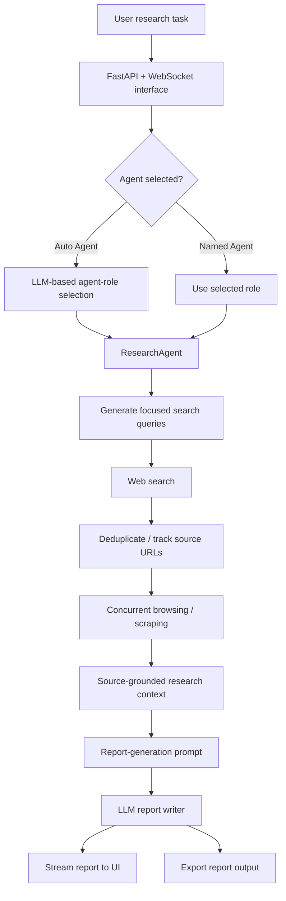
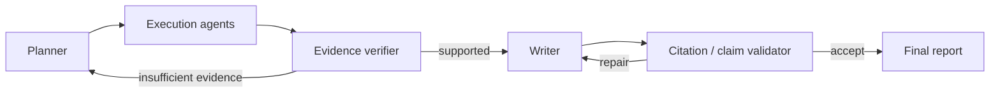

# Architecture

This document describes the architecture that is implemented in this repository today and separates it from planned research extensions.

## Implemented data flow

The implementation is centered on `logic/research_agent.py`:

- `create_search_queries()` decomposes the research task into search queries;
- `async_search()` retrieves candidate URLs and browses them concurrently;
- `conduct_research()` accumulates source material for the task;
- `write_report()` synthesizes the accumulated context into the requested report format;
- `logic/run.py` orchestrates execution and reports wall-clock runtime;
- `app.py` exposes the workflow through FastAPI and WebSockets.

## Agent roles

The system has two levels of agentic behavior.

### 1. Task-specific role selection

When the user selects `Auto Agent`, `logic/llm_utils.py::choose_agent()` asks the LLM to select a task-specific role and role prompt. This gives the downstream research workflow a domain-specific perspective.

### 2. Planner / execution workflow

The research agent decomposes the task into multiple focused search queries. Each query drives retrieval and concurrent web browsing, after which the collected material is synthesized into a final report.

This is best understood as a planner–execution–synthesis architecture rather than as a fully autonomous general-purpose agent.

## State and source handling

Each `ResearchAgent` instance maintains:

- the original research question;
- the selected agent role;
- a set of visited URLs to avoid repeated browsing;
- accumulated research context;
- an output directory identified by UUID;
- a WebSocket used for streamed progress and report output.

The new `logic/evaluation.py` module adds dependency-free utilities for normalizing run traces and aggregating evaluation metrics. It is intentionally separate from the online inference path so experiments can be scored offline and reproducibly.

## Failure boundaries

The current implementation may fail at several points:

1. search-provider failure;
2. inaccessible or JavaScript-heavy pages;
3. malformed LLM JSON during query or role generation;
4. model/API rate or provider failure;
5. irrelevant retrieved sources;
6. unsupported claims introduced during synthesis;
7. high token or latency cost for large research tasks.

These failure modes motivate the evaluation plan in [`EVALUATION.md`](EVALUATION.md).

## Planned research extensions

The following are research directions, **not claims about the current implementation**:

Planned extensions include:

- claim-to-source alignment checks;
- confidence-aware source filtering;
- verifier-guided report repair;
- adaptive stopping based on evidence coverage;
- model routing for cost/latency trade-offs;
- structured traces for ablation studies.

## Design principle

The project treats web research as a measurable pipeline:

> **plan → retrieve → inspect → synthesize → evaluate**

The goal of the current graduate-application-oriented research work is not to claim that more agents automatically improve quality, but to measure which orchestration and verification choices improve reliability, source coverage, latency, and cost.
